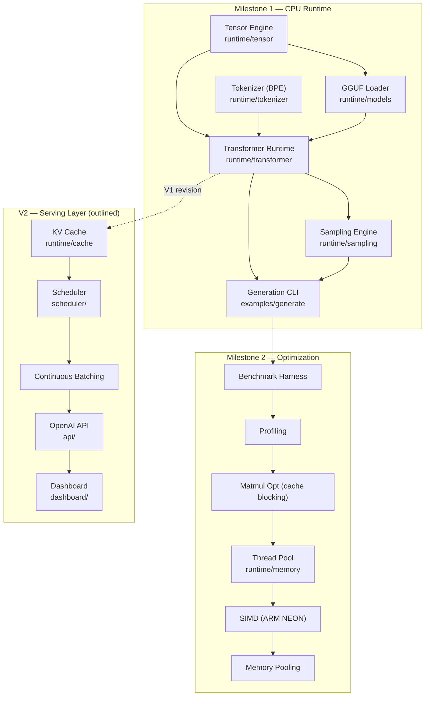

# Subsystem Dependency Graph

This graph defines the **build order** for Titan. An arrow `A --> B` means *B depends on A* (A must exist and be correct before B can be finished). It is the source of truth for how the GitHub issues are sequenced across milestones.



## Critical path to first token (Milestone 1)

```
Tensor Engine ──▶ GGUF Loader ──▶ Transformer Runtime ──▶ Sampling ──▶ CLI
                                    ▲
Tokenizer ──────────────────────────┘
```

- **Tensor Engine** is the root dependency — everything numerical sits on it, so it lands first.
- **Tokenizer** is independent of the tensor engine and can be built in parallel; its final wiring depends only on the GGUF metadata parser (for the embedded vocab).
- **GGUF Loader** depends on the Tensor engine (to wrap loaded weights as tensor views).
- **Transformer Runtime** is the convergence point: it needs the tensor engine, the loaded weights, and the tokenizer.
- **Sampling** and the **CLI** sit on top of the forward pass.

## Milestone 2 ordering

Optimization is strictly **profile-first**: the benchmark harness and profiler come before any optimization so that every change (matmul blocking → threading → SIMD → memory pooling) is justified by before/after data.

## V2 revisions to V1

Two V1 subsystems get revised (not rewritten) in V2, and these are called out explicitly in their issues:

1. **Attention** (`runtime/transformer`) gains a KV-cache read/append path.
2. **Forward pass** gains batched/ragged execution to support continuous batching.
